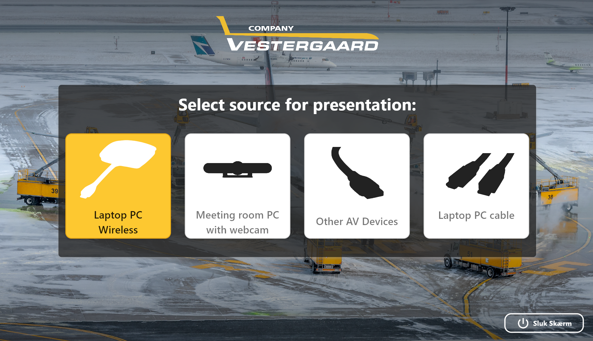

# Meeting Room HDMI Switcher Controller
A user-friendly solution for managing HDMI switchers via RS232 communication, designed for Vestergaard Company meeting rooms. The system features seamless input switching and output control through a Flutter front-end and a Go back-end.

## Features
- Switch HDMI Inputs: Control inputs for laptops, AV devices, and webcams.
- Turn Off Output Displays: Manage the TV or display output.
- Reliable RS232 Connection: Sends and reads commands over a serial connection.
- Client-Friendly UI: Simple buttons for non-technical users.

### Example UI:



## Technologies Used
### Frontend
- Flutter - Front-end interface using Dart.
- HTTP - Communication with the backend.
### Backend
- Go (Golang) - Handles RS232 communication and HTTP server.
- Gorilla Mux - REST API routing.
- go.bug.st/serial - Serial port management.

## Configuration
The backend uses a config.json file to define:

- **Port settings:** Specify the RS232 connection details (e.g., device, baud_rate) as provided in the HDMI switcher manual.
- **Commands:** Easily map labeled commands (e.g., input_1, turn_off) to the RS232 commands for your HDMI switcher.
- **Startup Commands:** Add commands to run automatically when the server starts.
```
{
    "device": "COM11",
    "baud_rate": 9600,
    "data_bits": 8,
    "stop_bits": 1,
    "parity": "none",
    "labeled_commands": {
        "input_1": ">>HDMI1",
        "input_2": ">>HDMI2",
        "input_3": ">>HDMI3",
        "input_4": ">>HDMI4",
        "turn_off": ">>TVOff"
    },
    "startup_commands": [
        ">>MANUAL",
        ">>HDMI1"
    ]
}
```
## Setup
### 1. Backend
- Install Go: Go Installation
- Clone the project:
```
git clone https://github.com/username/meeting_room_switcher.git](https://github.com/Oskarbayy/MeetingRoomSoftware.git
cd backend
```
- Run the server:
```
go run main.go
```
### 2. Frontend
- Install Flutter: Flutter Installation
- Navigate to the Flutter app:
```
cd frontend
flutter pub get
flutter run
```
## API Reference
### Switch Input
- URL: POST /api/button/{id}
- IDs:
  - 0: Turn Off Output
  - 1: Turn On Output
  - 2: Laptop PC Wireless
  - 3: Meeting Room PC
  - 4: Other AV Devices
  - 5: Laptop PC Cable

## About
This project is tailored for Vestergaard Company meeting rooms to simplify HDMI management and enhance the presentation experience.
